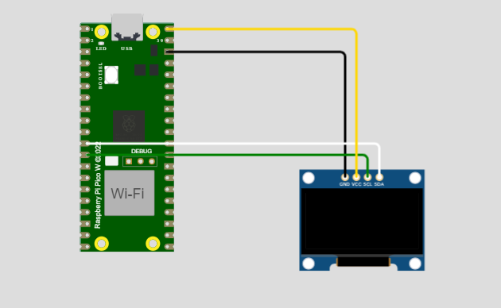
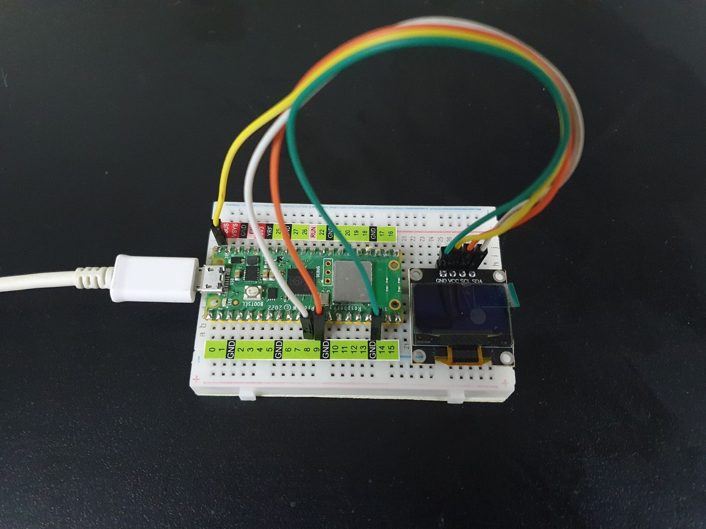
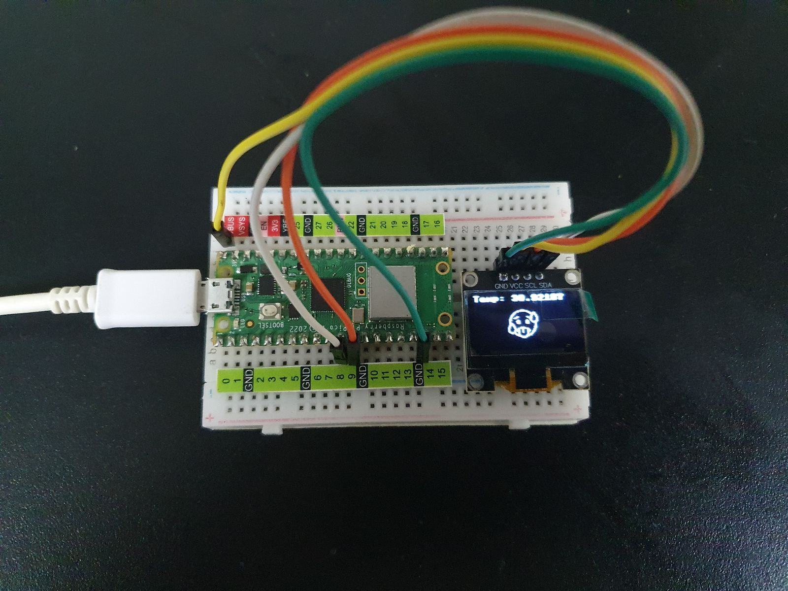
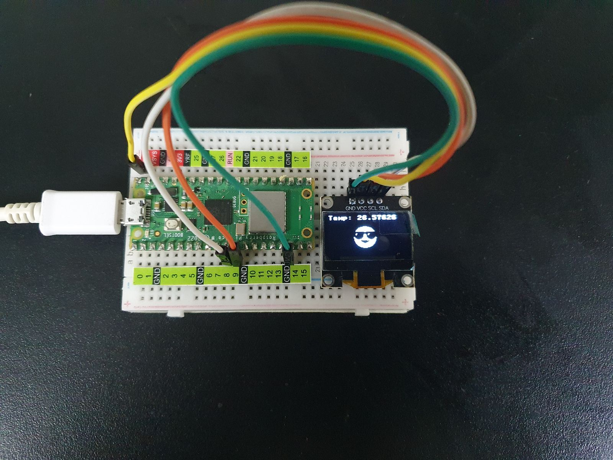
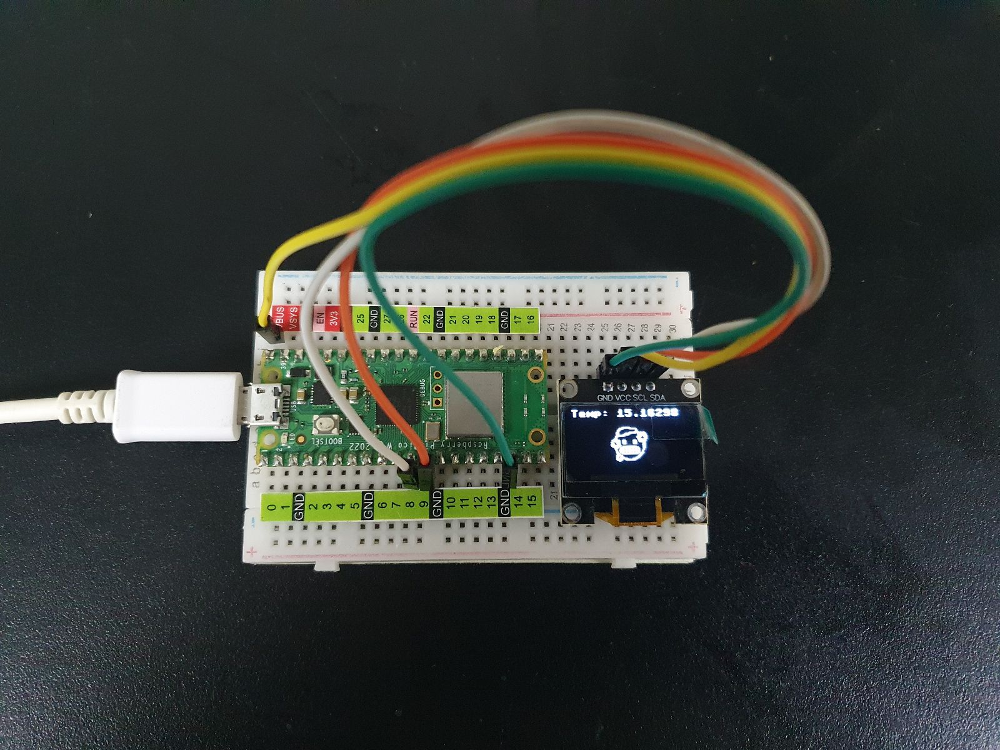

# Practica-2.2

# 2.1 Practica Hola Mundo y la Hora de Internet (NTP Time server) 
Depto de Sistemas y Computación  
Ing. En Sistemas Computacionales  
SISTEMAS PROGRAMABLES 23a  
Autor: Jesús Elías Martínez  
Fecha de entrega:   16/10/2023  
Objetivo: Investigar y prácticar la maniuplación de la raspberry pico W con la pantalla oled con su propio sensor de temperatura  

**Modelado en wokwi**  
  

**Conexiones (en físico)**  
 

**Código de thonny**   
Lenguaje: Phyton
```
```

**Resultados**
Calor
  

Cálido
  

Frío
  

